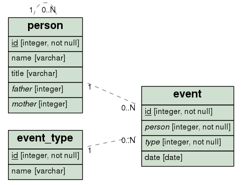

# Dendrogram: Create a Family Tree Using the Java Persistence API
This Java application generates a graphical representation of a family tree, based on genealogical data stored in a
relational database. The program outputs a DOT graph description language script, which may be used to create
an image file.

## Installation
The genealogical data are kept in a relational database. You can use any relational database management system. The following are
installation instructions for PostgreSQL.

1. Create the genealogical database and a user account:
> `psql -U postgres -h localhost -f src/sql/database.sql`

2. Create the database structure:
> `psql -U genealogist -d family_tree -h localhost -f src/sql/database-structure.sql`

3. Optionally, populate the database with some sample data. You may of course also use your own genealogical data.
> `psql -U genealogist -d family_tree -h localhost -f src/sql/sample-data.sql`

The program creates a DOT script, that represents the family tree as a directed graph. The AT&T Labs
[GraphViz](http://www.graphviz.org) package is then used to generate an image file from the script.
The following command installs the Graphviz package on a Debian based Linux system:
> `sudo apt-get install graphviz`

Finally, you need to compile the Java application.

1. Download the application source code, using git:  
   `git clone git://github.com/deriksson/Dendrogram.git`.

2. The following command creates a JAR file in the `dist` sub-directory:  
   `ant`

## Usage
The Dendrogram application is run from the command line. The general format of the command looks like this:
>`java se.abc.dendrogram.report.GraphVizTreeApplication <Person ID>`

The person ID is an integer corresponding to the record in the database, that constitutes the leaf of the family tree. All
known ancestors of the record will be included in the graph. The DOT code will be output to the system output stream. Here
is an example command:

>`java -classpath dist/dendrogram.jar:lib/deploy/orm/hibernate/*:lib/deploy/logging/*:lib/deploy/jdbc/* se.abc.dendrogram.report.GraphVizTreeApplication 5`

The DOT code may be redirected to a file, for further processing by the Graphviz application:
>`java -classpath dist/dendrogram.jar:lib/deploy/orm/hibernate/*:lib/deploy/logging/*:lib/deploy/jdbc/* se.abc.dendrogram.report.GraphVizTreeApplication 5 > /tmp/family-tree.dot`  
>`dot -Tpng -Gcharset=utf8 -o/tmp/family-tree.png /tmp/family-tree.dot`

These commands may be piped like this:
>`dot -Tpng -Gcharset=utf8 -o/tmp/family-tree.png <(java -classpath dist/dendrogram.jar:lib/deploy/orm/hibernate/*:lib/deploy/logging/*:lib/deploy/jdbc/* se.abc.dendrogram.report.GraphVizTreeApplication 5)`

The last two commands both create a PNG image file, `/tmp/family-tree.png` in this case. For other available image formats, please consult the GraphViz online documentation. Use any image viewer to look at the resulting file, e.g.:
>`eog /tmp/family-tree.png &`

## Architecture
The following diagram describes the family tree entity-relationship model. Ancestry is a recursive relationship and is displayed as a “pig's” ear of the person table.

